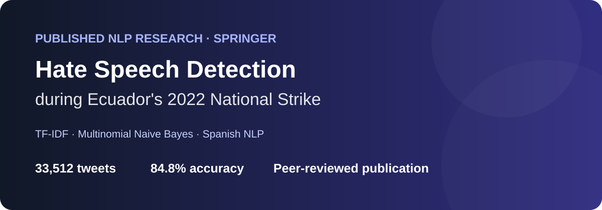
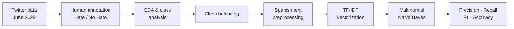

<p align="center">
  
</p>

<h1 align="center">Hate Speech Detection during Ecuador's 2022 National Strike</h1>

<p align="center">
  <strong>Published NLP Research · Springer</strong><br>
  An applied Machine Learning study for identifying hate speech targeting Indigenous people and communities on Twitter during Ecuador's June 2022 national strike.
</p>

<p align="center">
  <a href="https://doi.org/10.1007/978-3-031-70760-5_25"></a>
  
  
  
</p>

## At a glance

| Dataset | Task | Model | Notebook result |
|---|---|---|---|
| **33,512 tweets** | Binary hate-speech classification | **TF-IDF + Multinomial Naive Bayes** | **84.79% accuracy** |

This repository is the portfolio implementation associated with the conference paper **“Hate Speech Detection on Twitter: A Machine Learning Approach to Identify Attacks on Indigenous People During the 2022 Ecuador Strike.”**

> **Why this project matters:** it connects an end-to-end NLP workflow with a real research question and a peer-reviewed publication: annotation, exploratory analysis, class balancing, text processing, feature extraction, probabilistic classification, evaluation, and scientific communication.

## Published research

**Authors:** Saire Conejo, Jairo Quelal, Silvana Escobar, Alexandra Jima-González, Erick Cuenca, José Ángel Alcántara  
**Publisher:** Springer  
**Series:** Lecture Notes in Networks and Systems, Vol. 1134  
**Pages:** 267–275  
**DOI:** [10.1007/978-3-031-70760-5_25](https://doi.org/10.1007/978-3-031-70760-5_25)  
**Publication:** [Springer chapter](https://link.springer.com/chapter/10.1007/978-3-031-70760-5_25)

## Research question

Can Natural Language Processing and Machine Learning identify hate speech directed at Indigenous people during a major period of political and social mobilization in Ecuador?

The published study analyzes Spanish-language Twitter activity from the June 2022 national strike. The original annotated dataset contained:

- **33,512 total tweets**
- **29,782 No Hate**
- **3,730 Hate**

Because the original classes were strongly imbalanced, the primary modeling experiment randomly undersampled the majority class to create a balanced training dataset.

## ML pipeline



### 1. Exploratory analysis

The analysis examines class distribution and the evolution of Hate/No-Hate tweets over the strike period. The research also uses word-frequency visualization to explore recurrent language in the hate-speech subset.

### 2. Class balancing

The original dataset is imbalanced. The supplied notebook selects the same number of No-Hate examples as Hate examples, creating a balanced dataset before the train/test split.

### 3. Text representation

The classifier uses **TF-IDF** to transform tweet text into numerical features.

The preprocessing experiment additionally performs operations including lowercasing, removal of mentions and URLs, hashtag-symbol handling, removal of special characters, tokenization, and Spanish stop-word removal.

### 4. Classification

The implementation uses **Multinomial Naive Bayes**, a probabilistic classifier commonly used for text-classification tasks.

### 5. Evaluation

The supplied notebook uses an **80/20 train/test split** and evaluates predictions with accuracy, precision, recall, F1-score, and a confusion matrix.

## Results

### Result reproduced in the supplied notebook

The baseline TF-IDF + Multinomial Naive Bayes experiment reports:

| Class | Precision | Recall | F1-score |
|---|---:|---:|---:|
| No Hate | **0.88** | 0.79 | 0.83 |
| Hate | 0.82 | **0.90** | **0.86** |
| **Weighted average** | **0.85** | **0.85** | **0.85** |

**Test accuracy: 84.79%**

A second notebook run using the preprocessed-text column reports **84.32% accuracy**, with weighted precision/recall/F1 of approximately **0.85 / 0.84 / 0.84**.

### Published Perspective API experiment

The paper also describes an additional verification experiment using Google Perspective API's **Identity Attack** attribute with a threshold of 0.5. After intersecting the human labels with this verification, the hate subset decreased from **3,730 to 213 tweets**. The paper reports approximately **89.5% accuracy** on the resulting 426-tweet balanced experiment.

> The Perspective API implementation is **not present in the notebook supplied with this repository**. The 89.5% figure is therefore documented as a **published-paper result**, not as a result reproduced by the included code.

## What the results show

The baseline experiment reaches roughly **85% overall classification performance**, with particularly high recall for the Hate class in the saved notebook output. This means the model identifies a large proportion of the Hate examples in the held-out test set, while still producing false positives and false negatives.

The paper also identifies an important limitation: the approach can struggle with expressions that carry double meanings. This is especially relevant in hate-speech detection, where context, irony, coded language, and cultural nuance can affect interpretation.

## Research contribution

This work demonstrates how an applied NLP pipeline can be used to investigate harmful online discourse around a real social event. It combines:

`Data Collection` → `Human Annotation` → `EDA` → `NLP` → `Machine Learning` → `Evaluation` → `Scientific Publication`

### Personal contribution

**To be completed before publishing the portfolio:** add the specific parts of the research personally completed by the repository owner (for example: data collection, annotation, EDA, preprocessing, model implementation, evaluation, visualization, or manuscript preparation).

This section is intentionally not inferred from co-authorship alone.

## Tech stack

**Python · Pandas · scikit-learn · NLTK · TF-IDF · Multinomial Naive Bayes · Matplotlib · Seaborn · WordCloud**

## Repository structure

```text
hate-speech-detection-ecuador/
├── data/
│   └── README.md
├── docs/
│   ├── hero.svg
│   └── README.md
├── notebooks/
│   └── hate_speech_detection.ipynb
├── src/
│   └── README.md
├── .gitignore
├── README.md
└── requirements.txt
```

## Data, privacy, and ethics

The public portfolio intentionally **does not redistribute the original tweet-level dataset**. The research concerns abusive language targeting a marginalized community, and raw posts can contain usernames, identifiers, or harmful content that is unnecessary for demonstrating the technical workflow.

To reproduce the notebook, place an appropriately authorized dataset at:

```text
data/hate_speech_tweets.csv
```

Do not commit raw tweet data, credentials, API tokens, or environment secrets.

## Run locally

```bash
git clone https://github.com/YOUR-USERNAME/hate-speech-detection-ecuador.git
cd hate-speech-detection-ecuador

python -m venv .venv
source .venv/bin/activate   # Windows: .venv\Scripts\activate

pip install -r requirements.txt
jupyter notebook notebooks/hate_speech_detection.ipynb
```

## Citation

If this research is useful to your work, please cite the published chapter:

```bibtex
@inproceedings{conejo2024hatespeech,
  title={Hate Speech Detection on Twitter: A Machine Learning Approach to Identify Attacks on Indigenous People During the 2022 Ecuador Strike},
  author={Conejo, Saire and Quelal, Jairo and Escobar, Silvana and Jima-Gonz{\'a}lez, Alexandra and Cuenca, Erick and Alc{\'a}ntara, Jos{\'e} {\'A}ngel},
  booktitle={Applied Engineering and Innovative Technologies},
  series={Lecture Notes in Networks and Systems},
  volume={1134},
  pages={267--275},
  year={2024},
  publisher={Springer},
  doi={10.1007/978-3-031-70760-5_25}
}
```

---

<p align="center">
  <strong>Research → Reproducible Code → Portfolio</strong>
</p>
